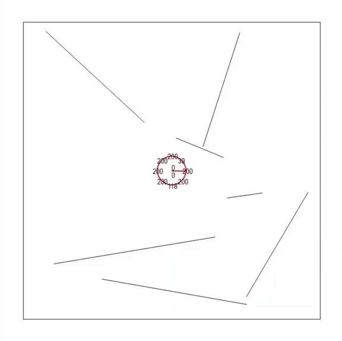

<!-- # Alexandra_Portfolio
Data Science and Web Development portfolio -->

# [Autonomous Robotic Systems](https://github.com/AlexandraDI/Autonomous_Robotic_Systems)

Implementation of 5 Assignments for the course Autonomous Robotic Systems.

* Task 1: Test a Swarm Intelligence algorithm on Benchmark Functions.

<!--  -->

  

* Task 2: Implementation of a Robot Simulator.

<!-- 
 -->

  

 
 * Task 3: Apply Evolutionary Algorithms on Benchmark Functions.
 
 
  
  

* Task 4: Apply Evolutionary Algorithm to make the Robot collect as much dust as possible in different Environments.

  

* Task 4: Mobile Robot Localization with Kalman Filters.

  

# [Reasoning with Natural Language](https://github.com/AlexandraDI/Reasoning_with_Natural_Language)

This project researches the task of reasoning with controlled natural language (CNL).

  
 
  
 
  
 
 

# [Machine Learning Projects](https://github.com/AlexandraDI/Machine_Learning)

Implementation of Backpropagation, AutoEncoders and Quantum Machine Learning assignments. 

# [Tactical Voting Analyst](https://github.com/AlexandraDI/Tactical_Voting_Analyst)

Implementation of  a Tactical Voting Analyst, which, given an honest voting situation, computes the outcome and calculates the individual happiness and the overall happiness of the voters.

  

 

  
 
  
 
  
 
   
 

# [ALMA](https://github.com/AlexandraDI/ALMA)

A web application that provides online services for obtaining Golden Visa from Greece.

<!-- 

 
 -->

<!-- 
 -->

<!-- 

 -->

# [Connections](https://github.com/AlexandraDI/Connections)

A web application that implements some typical social network features.

 

<!--  -->

<h2>Technologies</h2>

Model : <b>JPA</b> [(Source)](./src/java/dao) (Java Persistence API) + <b>MySQL</b> [(Picture of Relational Database)](./pics/Database.png) 
View : <b>JSP</b> (JavaServer Pages) + <b>JSTL</b> (JavaServer Pages Standard Tag Library) [(Source)](./web/WEB-INF/complete) 
Controller : <b>Java Servlet Technology</b> [(Source)](./src/java/servlets/navigation)  
Security : <b>SSL</b> (Secure Sockets Layer) 
IDE : <b>Netbeans</b> 8.2

<h2> Database </h2>

<b>MySQL Workbench</b> Version 6.3.6 (64 bits) [(Download Relational Database From Here)](./linkedin.mwb)

<h2> Pictures of the Project:</h2>

[More Pictures](./pics)
